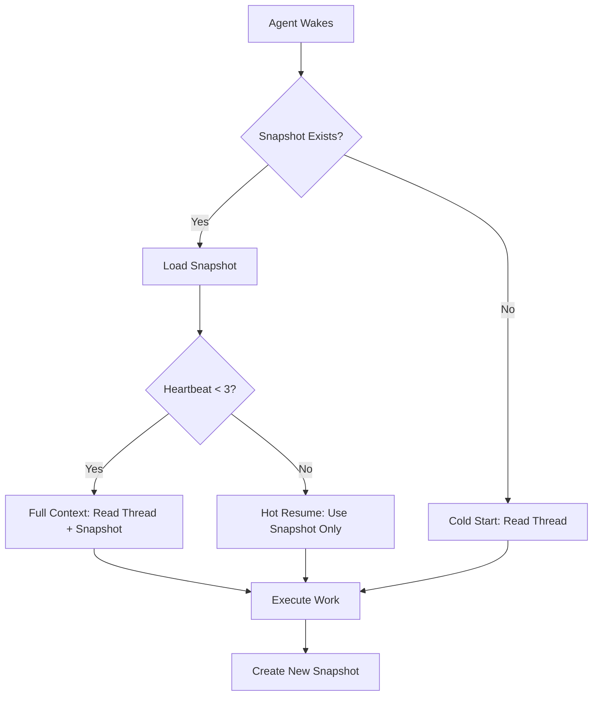

# Workspace State Snapshots and Memory Recovery

**Version:** 1.0  
**Issue:** [BIO-612](/BIO/issues/BIO-612)  
**Status:** Active  
**Last Updated:** 2026-06-22

## Overview

Workspace state snapshots provide agents with context continuity across heartbeat boundaries. When an agent resumes work on an issue, the snapshot loads automatically, restoring understanding of recent work, decisions, and next actions.

## Problem Statement

Agents lose in-heartbeat context when resuming work after:
- Heartbeat timeout/boundary
- Adapter failures or model unavailability
- Issue hand-offs between agents
- Multi-day task gaps

This forces agents to re-read full issue threads, re-examine files, and reconstruct decisions — wasting time and budget.

## Solution: Structured Snapshots

### Snapshot Format

```json
{
  "version": "1.0",
  "issueId": "issue-uuid",
  "issueIdentifier": "BIO-612",
  "agentId": "agent-uuid",
  "agentNameKey": "ceo",
  "runId": "run-uuid",
  "createdAt": "2026-06-22T00:00:00.000Z",
  "heartbeatNumber": 3,
  "context": {
    "summary": "Brief one-line status of current work",
    "currentPhase": "implementation | planning | review | blocked",
    "lastDecision": "Most recent significant decision made",
    "criticalContext": [
      "Key fact 1 that must not be forgotten",
      "Key fact 2 essential for next heartbeat"
    ]
  },
  "filesActivity": {
    "read": [
      { "path": "relative/path/to/file.ts", "timestamp": "2026-06-22T00:00:00.000Z", "purpose": "why read" }
    ],
    "modified": [
      { "path": "relative/path/to/file.ts", "timestamp": "2026-06-22T00:00:00.000Z", "change": "what changed" }
    ],
    "created": [
      { "path": "relative/path/to/file.ts", "timestamp": "2026-06-22T00:00:00.000Z", "purpose": "why created" }
    ]
  },
  "commandsExecuted": [
    {
      "command": "npm test",
      "exitCode": 0,
      "timestamp": "2026-06-22T00:00:00.000Z",
      "outcome": "tests passed | failed | blocked",
      "keyOutput": "Relevant output snippet"
    }
  ],
  "decisions": [
    {
      "decision": "Chose approach X over Y",
      "rationale": "Because Z constraint",
      "timestamp": "2026-06-22T00:00:00.000Z",
      "alternatives": ["Approach Y: reason not chosen"]
    }
  ],
  "remainingWork": [
    { "item": "Task description", "priority": "high | medium | low", "estimated": "complexity estimate" },
    { "item": "Another task", "priority": "medium", "estimated": "small" }
  ],
  "nextAction": {
    "recommended": "Specific next concrete action",
    "prerequisite": "Any blocker or dependency",
    "estimatedEffort": "small | medium | large"
  },
  "blockers": [
    {
      "description": "What is blocked",
      "type": "external | internal | approval",
      "unblockAction": "Who/what must act",
      "since": "2026-06-22T00:00:00.000Z"
    }
  ],
  "metadata": {
    "snapshotSize": 1234,
    "compressionType": "none | gzip",
    "checksum": "sha256-hash"
  }
}
```

### Storage Location

Snapshots are stored per-issue in the project workspace:

```
.paperclip/
  agents/
    {agentNameKey}/
      snapshots/
        {issueIdentifier}/
          {timestamp}-{runId}.json
          latest.json  # symlink to most recent
```

Example:
```
.paperclip/agents/CEO/snapshots/BIO-612/2026-06-22T00-11-00-abc123.json
.paperclip/agents/CEO/snapshots/BIO-612/latest.json -> 2026-06-22T00-11-00-abc123.json
```

### Retention Policy

- Keep last 10 snapshots per issue per agent
- Archive older snapshots to `.paperclip/agents/{agent}/snapshots/{issue}/archive/`
- Snapshots for `done` or `cancelled` issues are archived after 7 days
- Archived snapshots are compressed (gzip)

## Implementation

### 1. Snapshot Creation Helper

**Location:** `scripts/paperclip/create-snapshot.sh`

```bash
#!/usr/bin/env bash
# Usage: ./scripts/paperclip/create-snapshot.sh [--issue-id ISSUE_ID] [--auto]

# Reads from environment:
# - PAPERCLIP_TASK_ID (issue ID)
# - PAPERCLIP_AGENT_ID
# - PAPERCLIP_RUN_ID
# - PAPERCLIP_AGENT_NAME_KEY (derived from agent data)

# Accepts JSON snapshot data on stdin or via --file parameter
# Creates snapshot in .paperclip/agents/{agent}/snapshots/{issue}/
# Updates latest.json symlink
# Prunes old snapshots per retention policy
```

### 2. Snapshot Retrieval Helper

**Location:** `scripts/paperclip/load-snapshot.sh`

```bash
#!/usr/bin/env bash
# Usage: ./scripts/paperclip/load-snapshot.sh [--issue-id ISSUE_ID] [--agent AGENT_KEY]

# Reads latest snapshot for issue+agent
# Outputs JSON to stdout
# Returns exit code 1 if no snapshot exists
```

### 3. Agent Integration

Agents should:

**On heartbeat start:**
1. Load latest snapshot for current issue
2. Review `context.summary`, `remainingWork`, `nextAction`
3. Check `blockers` array for unresolved blocks
4. Continue from `nextAction.recommended`

**During heartbeat:**
5. Track files read/modified
6. Record significant decisions and rationale
7. Note commands executed and outcomes

**Before heartbeat end:**
8. Update `remainingWork` array
9. Set `nextAction.recommended` for next agent/heartbeat
10. Create snapshot using helper script
11. Post status comment referencing snapshot if context is complex

### 4. Recovery Protocol

**Agent Wake Procedure:**



**Recovery from Failure:**

If previous run failed (adapter error, timeout, etc.):
1. Load latest snapshot
2. Check `commandsExecuted` for incomplete operations
3. Verify any partial file changes
4. Resume from last known good state
5. Record recovery action in new snapshot

## Testing

### Test Cases

1. **Basic snapshot creation and retrieval**
   - Agent creates snapshot
   - Verify JSON structure
   - Load snapshot and verify contents

2. **Cross-heartbeat continuity**
   - Agent A works on issue → creates snapshot
   - Agent A resumes → loads snapshot → continues work
   - Verify no context loss

3. **Agent handoff**
   - Agent A works on issue → creates snapshot
   - Agent B assigned issue → loads snapshot
   - Verify Agent B has A's context

4. **Failure recovery**
   - Agent starts work → partial progress → failure
   - New run loads snapshot
   - Verify recovery from last good state

5. **Retention policy**
   - Create 15 snapshots
   - Verify only last 10 remain
   - Verify older ones archived

### Test Agents

Test with at least 3 agent types:
- **HermesEngineer** (code-heavy workflow)
- **Coder** (implementation focus)
- **Manager** (coordination and delegation)

## Usage Examples

### Example 1: CEO Coordination Work

```json
{
  "version": "1.0",
  "issueId": "uuid",
  "issueIdentifier": "BIO-598",
  "agentId": "ceo-uuid",
  "agentNameKey": "ceo",
  "heartbeatNumber": 1,
  "context": {
    "summary": "Daily coordination routine - reviewed 4 in_progress, 12 in_review",
    "currentPhase": "review",
    "lastDecision": "Flagged budget approval (BIO-259) and credentials gate (BIO-84) as critical blockers",
    "criticalContext": [
      "Budget approval blocks multiple operational initiatives",
      "Credentials gate blocks entire GEO pipeline (Pillar 3)"
    ]
  },
  "filesActivity": {
    "read": [
      { "path": "memory/2026-06-21.md", "timestamp": "2026-06-21T23:48:00Z", "purpose": "previous day memory" }
    ],
    "modified": [
      { "path": "memory/2026-06-21.md", "timestamp": "2026-06-21T23:50:00Z", "change": "added BIO-598 daily coordination section" }
    ]
  },
  "commandsExecuted": [
    {
      "command": "curl /api/agents/me/inbox-lite",
      "exitCode": 0,
      "timestamp": "2026-06-21T23:48:30Z",
      "outcome": "fetched inbox successfully",
      "keyOutput": "16 assigned issues"
    }
  ],
  "decisions": [
    {
      "decision": "Mark budget approval (BIO-259) as critical priority blocker",
      "rationale": "Blocks $700/mo operational initiatives across multiple teams",
      "timestamp": "2026-06-21T23:49:00Z"
    }
  ],
  "remainingWork": [],
  "nextAction": {
    "recommended": "Routine complete - next execution tomorrow 09:00 UTC",
    "prerequisite": "None",
    "estimatedEffort": "automated"
  }
}
```

### Example 2: Code Implementation Work

```json
{
  "version": "1.0",
  "issueIdentifier": "BIO-546",
  "agentNameKey": "cto",
  "heartbeatNumber": 2,
  "context": {
    "summary": "Hermes delegation test - implementing MCP health check endpoint",
    "currentPhase": "implementation",
    "lastDecision": "Use Express middleware for health checks rather than raw http",
    "criticalContext": [
      "Health check must work even if MCP servers are down",
      "Response format must match Hermes expectations"
    ]
  },
  "filesActivity": {
    "read": [
      { "path": "server/src/server.ts", "purpose": "understand current Express setup" },
      { "path": "server/src/mcp/client.ts", "purpose": "understand MCP client structure" }
    ],
    "modified": [
      { "path": "server/src/server.ts", "change": "added /health endpoint returning 200 + MCP status" }
    ],
    "created": [
      { "path": "server/src/middleware/health.ts", "purpose": "health check logic" }
    ]
  },
  "commandsExecuted": [
    {
      "command": "npm run build",
      "exitCode": 0,
      "outcome": "build successful",
      "keyOutput": "Compiled server/src successfully"
    }
  ],
  "decisions": [
    {
      "decision": "Health endpoint always returns 200, even if MCP is down",
      "rationale": "Hermes needs to know server is alive, not whether MCP is healthy",
      "alternatives": ["Return 503 if MCP down - rejected because Hermes can't distinguish server vs MCP failure"]
    }
  ],
  "remainingWork": [
    { "item": "Add tests for /health endpoint", "priority": "high", "estimated": "small" },
    { "item": "Update Hermes health check config to use new endpoint", "priority": "medium", "estimated": "small" },
    { "item": "Document health check format in README", "priority": "low", "estimated": "small" }
  ],
  "nextAction": {
    "recommended": "Write tests for /health endpoint using vitest",
    "prerequisite": "None",
    "estimatedEffort": "small"
  }
}
```

## Benefits

1. **Faster resume**: Agents skip re-reading entire threads
2. **Better continuity**: Critical context preserved across boundaries
3. **Failure resilience**: Recovery from last known good state
4. **Audit trail**: Historical snapshots show work progression
5. **Handoff support**: New agents inherit context from previous agents
6. **Budget efficiency**: Less time reconstructing context = more productive work

## Rollout Plan

1. ✅ Design snapshot format (this document)
2. ⏳ Implement helper scripts (`create-snapshot.sh`, `load-snapshot.sh`)
3. ⏳ Add snapshot calls to CEO heartbeat procedure
4. ⏳ Test with CEO on next 3 issues
5. ⏳ Extend to CTO, CMO agents
6. ⏳ Add to agent onboarding docs
7. ⏳ Make snapshot creation mandatory in heartbeat close

## Related

- Parent: [BIO-590](/BIO/issues/BIO-590) - Make agents smarter
- Memory system: `memory/` directory (manual daily logs)
- Agent state: `.paperclip/agents/` directory

---

**Document Version:** 1.0  
**Authors:** CEO Agent  
**Last Review:** 2026-06-22
